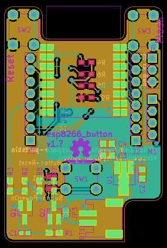

# Basic use

 

Assemble board.  It's intended to go into a 3d printed clamping housing, so
there are no mounting holes.  In order to power, you need to choose:

## Always on (use deep sleep!)

1. Close JP3 (right next to battery connector)
2. Board will be powered whenever you plug battery in
3. To flash, hold Flash (SW3) while you reset (SW2)

## Full poweroff

1. Close JP2 (back of board)
2. Set GPIO12 to HIGH in software.  When done, set LOW.
3. Board may power once initially, but once you turn off requires a button
   press.
4. To flash, hold Flash (SW3) while you turn it on (SW1).  Keep holding SW1
   until the entire flashing is complete.

## Expansion headers

1. Same pinout as Wemos D1 Mini (use low profile SW1, or omit).
2. Serial (3-pin header, pins labeled on back)
3. BMP180 breakout (or more generally, I2C and VBAT).
