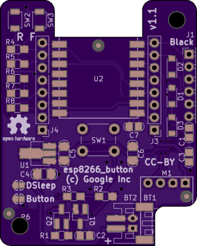

# Basic use

 

Assemble board.  The board itself is 40x50mm, and the mounting holes (centered)
are 32x42mm.  You probably want a 3d printed housing for it, but you need to
choose whether it's powered all the time (using deep sleep), or fully powers off
unless you tap SW1.  (Close one of "DSleep" or "Button" solder jumpers.)

Keep GPIO12 set HIGH to power things (including the battery monitor ADC pin and
the BMP180 header), otherwise set LOW to conserve power.

Shields based on the Wemos D1 Mini pinout should fit (though collide with SW1),
and will also be depowered by GPIO12.

